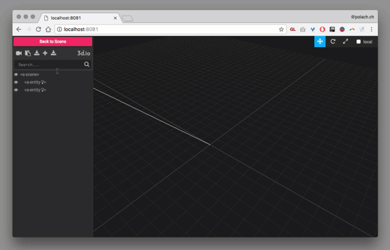

# A-Frame Inspector Plugins by 3d.io

### [Live Demo](https://archilogic-com.github.io/3dio-inspector-plugins)



More demos:
- [Google Blocks tag aka "gblock"](https://archilogic-com.github.io/3dio-inspector-plugins/google-blocks.html)
- [Furniture Library](https://archilogic-com.github.io/3dio-inspector-plugins/furniture-library.html)
- [Staff Picks](https://archilogic-com.github.io/3dio-inspector-plugins/staff-picks.html)

## Usage

1. Add the 3d.io library script to the `<head>` section of your page right after aframe like this:

```html
<head>
  <script src="https://aframe.io/releases/0.7.0/aframe.min.js"></script>
  <script src="https://dist.3d.io/3dio-js/1.x.x/3dio.min.js"></script>
</head>
<body>
  <a-scene></a-scene>
</body>
```

2. Open your page and start the A-Frame Inspector:
  - Windows: `ctrl` + `alt` + `i`
  - OSX: `control` + `option` + `i`
  
3. The `3d.io` button will be there ;) 

## Want to make changes?

### Installation


## Acknowledgements

- 
- [A-Frame](https://aframe.io/) 
- [three.js](https://threejs.org/)
- [GLTF loader](https://threejs.org/examples/#webgl_loader_gltf)

## License

Distributed under an [MIT License](LICENSE).
